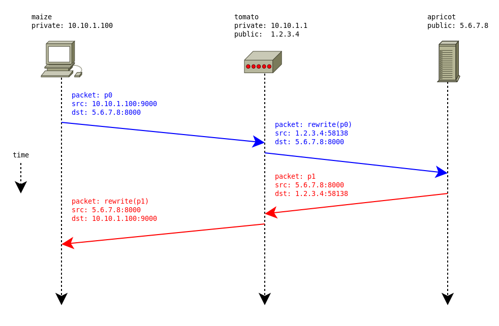

# Multi-Destination-Cast

Чтобы понять, как _multi-destination-cast_ решает нашу проблему, рассмотрим, что происходит с традиционной не Aeron-программой, которая использует UDP-сокеты для прямой отправки дейтаграмм



Клиентский компьютер `maize`имеет частный адрес `10.10.1.100`и находится за фильтром пакетов с отслеживанием состояния и NAT-маршрутизатором `tomato`. `tomato`имеет частный адрес `10.10.1.1`и публичный адрес `1.2.3.4`. Сервер `apricot`имеет публичный адрес `5.6.7.8`. В операционной системе `tomato`выполняется однонаправленный NAT: исходные адреса пакетов, отправляемых исходящими \(слева направо на диаграмме\) из частной сети, `10.10.*`будут перезаписаны так, что они будут поступать с общедоступного адреса `1.2.3.4`.

1. `maize`открывает сокет UDP и привязывает его `10.10.1.100:9000`, а затем использует сокет для отправки дейтаграммы `p0`в порт `8000`на сервере `apricot`.
2. `p0`Достигается датаграмма `tomato`, которая покорно выполняет преобразование сетевых адресов в пакете. Адрес источника `p0`перезаписывается на общедоступный адрес, `tomato`а порт источника изменяется на произвольный неиспользуемый порт с большим номером, что приводит к пакету `rewrite(p0)`с источником `1.2.3.4:58138`. Операционная система `tomato`записывает тот факт, что это переписывание имело место, а затем отправляет `rewrite(p0)`на свой путь `apricot`.
3. `apricot`получает `rewrite(p0)`и принимает это. Вскоре он отправляет ответный пакет `p1`обратно источнику `rewrite(p0)`.
4. Пакет `p1`достигает `tomato`и проверяется. Операционная система `tomato`видит, что пакет получен `5.6.7.8:8000`и предназначен для него `1.2.3.4:58138`, и замечает, что недавно он видел исходящий пакет, для `5.6.7.8:8000`которого он предназначен, и что он переписал адрес источника `1.2.3.4:58138`. Это делает предположение , что это должно быть пакет , отправленный в ответ на пакет он переписал ранее, и поэтому он переписывает назначения `p1`равным первоисточника `p0`- `10.10.1.100:9000`- и посылает его вперед.
5. Переписанный пакет, `rewrite(p1)`отправляется в пути и безопасно доставляется `maize`.

UDP - это протокол без установления соединения, но он может обрабатывать поток дейтаграмм как «соединение», отслеживая адреса отправителя и получателя и запоминая последние перезаписи адресов. Это стандартная практика для всех современных реализаций NAT и означает, что подавляющее большинство приложений UDP могут работать правильно, когда клиенты находятся за NAT.

Причина, по которой наши оригинал `EchoClient`и `EchoServer`реализация не могут работать за NAT, заключается в том, что сначала клиент отправляет дейтаграмму `d0`на сервер, а затем, основываясь на данных в пакете, сервер затем пытается отправить новую и совершенно не связанную дейтаграмму `d1`обратно в порт, который указанный клиент Очевидно, что маршрутизатор NAT ничего не знает о протоколе прикладного уровня между клиентом и сервером и поэтому не может знать о порте, согласованном между клиентом и сервером. В нем не будет записи о каких-либо недавних переписываниях, произошедших для порта, указанного в`d1`\(потому что ничего не произошло\), и поэтому пакет будет просто отброшен, когда достигнет маршрутизатора. Как упоминалось ранее, потоки в Aeron строго однонаправлены, и поэтому мы не можем создать объект \(например, традиционный сокет UDP\), который имеет как один адрес, так и порт, и который может принимать и отправлять сообщения.

Функция _многоадресной трансляции_ Aeron позволяет подписчикам добавлять себя в качестве пунктов назначения в _публикации_ таким образом, который будет работать правильно, когда подписчики находятся за NAT. По сути, _публикация_ может объявить _явный порт управления,_ который клиенты могут использовать для регистрации в качестве пунктов назначения для _публикации_ . _Публикация_ будет посылать данные для всех абонентов, которые зарегистрированы, а базовый протокол для этого реализован таким образом, что дейтаграммы , содержащие сообщения , написанных на _публикацию_ будут рассмотрены к _исходным адресам и портам_ из подписчиков. Это позволяет системам NAT обрабатывать пакеты данных как обычные ответные пакеты и, как таковые, они успешно доставляют подписчикам без проблем.

Вкратце, сервер в `5.6.7.8`может сделать эти два вызова:

```java
// aeron:udp?endpoint=5.6.7.8:9000|control=5.6.7.8:9001|control-mode=dynamic|reliable=true

final ConcurrentPublication server_pub =
  aeron.addPublication(
    new ChannelUriStringBuilder()
      .media("udp")
      .reliable(TRUE)
      .controlEndpoint("5.6.7.8:9001")
      .controlMode("dynamic")
      .endpoint("5.6.7.8:9000")
      .build(),
    SOME_STREAM_ID);

// aeron:udp?endpoint=5.6.7.8:9000|reliable=true

final Subscription server_sub =
  aeron.addSubscription(
    new ChannelUriStringBuilder()
      .media("udp")
      .reliable(TRUE)
      .endpoint("5.6.7.8:9000")
      .build(),
    SOME_STREAM_ID,
    image -> LOG.debug("server: a client has connected"),
    image -> LOG.debug("server: a client has disconnected"));
```

Первый вызов создает _публикацию_ , ожидающую _подписку_ на , `5.6.7.8:9000`а также создает _порт управления_ на `5.6.7.8:9001`. Он указывает, что ему нужен _динамический_ MDC, что означает, что клиенты будут автоматически добавляться в _публикацию в_ качестве пунктов назначения. Напротив, указание _ручного_ режима здесь означает, что клиенты должны были бы быть явно добавлены путем вызова `Publication.addDestination()`. Созданная _публикация_ используется для отправки сообщений всем клиентам. Обратите внимание, что мы конкретно имеем в виду _всех_ клиентов; у нас нет возможности обращаться к клиентам индивидуально. Это ограничение будет устранено в ближайшее время.

Второй вызов создает _подписку_ на `5.6.7.8:9000`который будет использоваться для приема сообщений от клиентов. Обратите внимание, что хотя _публикация_ и _подписка_ совместно используют одну и ту же `5.6.7.8:9000`конечную точку, они представляют собой совершенно разные потоки: записанные сообщения `server_pub`не будут доступны из `server_sub`.

В обоих случаях сервер использует произвольный _идентификатор потока для_ конкретного приложения с именем `SOME_STREAM_ID`. Клиенту нужно будет использовать то же значение.

Затем клиент `10.10.1.100`может совершить следующие звонки:

```java
// aeron:udp?endpoint=5.6.7.8:9000|reliable=true

final ConcurrentPublication client_pub =
  aeron.addPublication(
    new ChannelUriStringBuilder()
      .media("udp")
      .reliable(TRUE)
      .endpoint("5.6.7.8:9000")
      .build(),
    SOME_STREAM_ID);

// aeron:udp?endpoint=10.10.1.100:8000|control=5.6.7.8:9001|control-mode=dynamic|reliable=true

final Subscription client_sub =
  aeron.addSubscription(
    new ChannelUriStringBuilder()
      .media("udp")
      .reliable(TRUE)
      .controlEndpoint("5.6.7.8:9001")
      .controlMode("dynamic")
      .endpoint("10.10.1.100:8000")
      .build(),
    SOME_STREAM_ID,
    image -> LOG.debug("client: connected to server"),
    image -> LOG.debug("client: disconnected from server"));
```

Первый вызов создает _публикацию,_ которая будет отправлять сообщения на сервер по адресу `5.6.7.8:9000`.

Второй вызов создает _подписку_ , которая создает локальный сокет, `10.10.1.100:8000`который будет использоваться для получения сообщений от сервера, и будет динамически регистрироваться в качестве пункта назначения, связываясь с _контрольным сокетом_ на сервере по адресу `5.6.7.8:9001`. Если здесь не указан локальный сокет, реализация будет использовать произвольный эфемерный порт с большим номером на любом локальном IP-адресе, который он считает подходящим.

Как упомянуто, одна серьезная проблема с вышеупомянутым - то, что у сервера есть только одна _публикация,_ которая будет отправлять сообщения всем клиентам. Это менее чем полезно, если требуется реализовать протокол, подобный нашему `echo`, где каждый клиент должен иметь свой собственный поток сообщений и ответов. Текущее решение этой проблемы в Aeron состоит в том, чтобы просто создать несколько _публикаций_ и затем каким-то образом организовать для каждого нового подключающегося клиента подписку на новую _публикацию,_ предназначенную только для этого клиента. Теперь нам нужно переработать `echo`протокол для решения этой проблемы вместе со всеми другими слабостями реализации, обсуждавшимися до сих пор.

